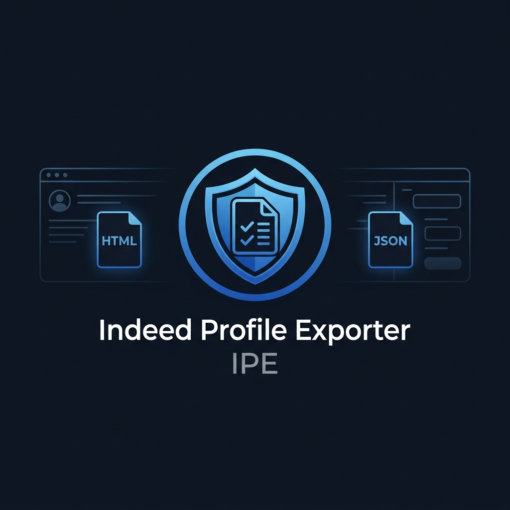

<p align="center">
  
</p>

<h1 align="center">Indeed Profile Exporter</h1>

<p align="center">
  <em>Export your own Indeed profile locally as clean HTML, JSON, or browser PDF — no backend, no tracking, just your data.</em>
</p>

<p align="center">
  <a href="https://ipe-cv.com"></a>&nbsp;
  <a href="https://ipe-cv.com/privacy/"></a>&nbsp;
  <a href="https://github.com/DVRK-ORG/ipe-cv/blob/main/LICENSE"></a>
</p>

<p align="center">
  &nbsp;
  &nbsp;
  &nbsp;
  &nbsp;
  &nbsp;
  
</p>

<br />

---

## ✨ What is IPE?

**IPE** is a **local-first** Chrome extension (Manifest V3) built for job seekers who want a clean, personal backup of their Indeed profile — without screenshots, copy-paste, or trusting a third-party server.

Open your profile → click Export → done.

<br />

## 🚀 Features

| | Feature | Description |
|---|---|---|
| 📄 | **HTML Export** | Standalone, readable HTML file — works offline |
| 📊 | **JSON Export** | Structured data snapshot for backup or automation workflows |
| 🖨️ | **PDF via Print** | Uses Chrome's native print dialog for pixel-perfect PDFs |
| 🔐 | **100% Local** | Zero backend — all processing stays inside your browser |
| ⚙️ | **Configurable** | Choose which sections to include: contact, resume, preferences, etc. |
| 🌍 | **Multi-region** | Supports 15+ Indeed country domains out of the box |
| 📂 | **Auto-expand** | Automatically expands hidden profile sections before export |

<br />

## 🔒 Privacy Boundary

IPE is designed for exporting **your own** account data. It does **not**:

- ❌ Store credentials, cookies, or session tokens
- ❌ Bypass Indeed login or access private profiles
- ❌ Send exported data to any server
- ❌ Collect analytics from the extension itself

> **All export processing happens locally inside Chrome.**
>
> Read the full [Privacy Policy →](https://ipe-cv.com/privacy/)

<br />

## 🛠️ Getting Started

### Prerequisites

- [Node.js](https://nodejs.org/) (see `.node-version`)
- npm (bundled with Node)

### Build

```bash
npm install
npm run build
```

The production build is generated in the `dist/` folder.

### Run Tests

```bash
npm run test:extension
```

> The smoke test loads `dist/` as an unpacked extension in Chromium, serves a mocked Indeed profile page, expands hidden sections, extracts profile data, saves options, and opens the HTML preview page.

<br />

## 🧩 Load Locally in Chrome

<table>
  <tr>
    <td width="40" align="center"><strong>1</strong></td>
    <td>Open <code>chrome://extensions</code></td>
  </tr>
  <tr>
    <td align="center"><strong>2</strong></td>
    <td>Enable <strong>Developer mode</strong></td>
  </tr>
  <tr>
    <td align="center"><strong>3</strong></td>
    <td>Click <strong>Load unpacked</strong></td>
  </tr>
  <tr>
    <td align="center"><strong>4</strong></td>
    <td>Select the <code>dist/</code> folder</td>
  </tr>
  <tr>
    <td align="center"><strong>5</strong></td>
    <td>Navigate to your Indeed profile page</td>
  </tr>
  <tr>
    <td align="center"><strong>6</strong></td>
    <td>Click the <strong>IPE</strong> toolbar icon → choose an export option</td>
  </tr>
</table>

<br />

## 📦 Package for Chrome Web Store

```bash
npm run package:chrome
```

The packaged `.zip` is created in the `releases/` folder, ready for upload to the [Chrome Web Store Developer Dashboard](https://chrome.google.com/webstore/devconsole/).

<br />

## 🏗️ Tech Stack

<table>
  <tr>
    <td align="center" width="120"><br /><strong>TypeScript</strong></td>
    <td align="center" width="120"><br /><strong>React 19</strong></td>
    <td align="center" width="120"><br /><strong>Vite 7</strong></td>
    <td align="center" width="120"><br /><strong>Chrome MV3</strong></td>
    <td align="center" width="120"><br /><strong>Playwright</strong></td>
    <td align="center" width="120"><br /><strong>Cloudflare</strong></td>
  </tr>
</table>

<br />

<details>
<summary><strong>📁 Project Structure</strong></summary>
<br />

```
ipe-cv/
├── public/                 # Static assets, manifest, icons
│   ├── manifest.json       # Chrome MV3 manifest
│   └── icons/              # Extension icon set (16–128px + SVG)
├── src/
│   ├── background/         # Service worker (MV3 background)
│   ├── content/            # Content script for Indeed pages
│   ├── popup/              # Extension popup UI
│   ├── options/            # Options page
│   ├── print/              # Print preview page
│   ├── shared/             # Shared types & utilities
│   └── site/               # Landing page (ipe-cv.com)
├── tests/                  # Playwright E2E smoke tests
├── scripts/                # Build & packaging scripts
├── releases/               # Packaged extension ZIPs
├── STORE_LISTING.md        # Chrome Web Store listing draft
├── DEPLOYMENT.md           # Deployment checklist
├── PRIVACY_POLICY.md       # Privacy policy source
├── LAUNCH_STATUS.md        # Infrastructure & launch log
└── vite.config.ts          # Vite build configuration
```

</details>

<br />

## 🔗 Project Links

| | Link |
|---|---|
| 🌐 | [**ipe-cv.com**](https://ipe-cv.com) — Landing page |
| 🔒 | [**Privacy Policy**](https://ipe-cv.com/privacy/) |
| 🏪 | [`STORE_LISTING.md`](STORE_LISTING.md) — Chrome Web Store listing draft |
| 🚀 | [`DEPLOYMENT.md`](DEPLOYMENT.md) — Deployment checklist |
| 📋 | [`LAUNCH_STATUS.md`](LAUNCH_STATUS.md) — Infrastructure & launch log |

<br />

## ⚖️ Disclaimer

IPE is an **independent** tool and is **not** affiliated with, endorsed by, or sponsored by Indeed.

<br />

---

<p align="center">
  <sub>Built with 🖤 by <a href="https://github.com/DVRK-ORG">DVRK-ORG</a></sub>
</p>
